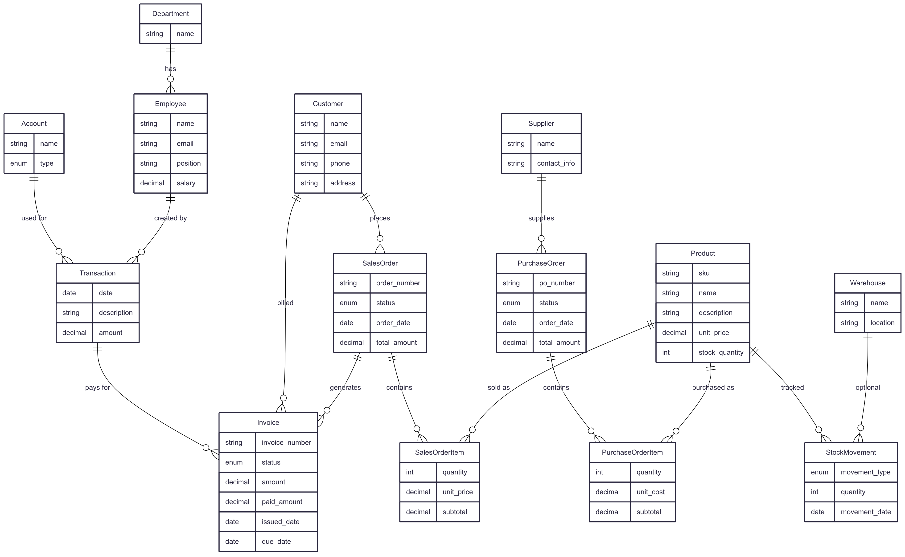

# 🏢 ERP Prototype System

A comprehensive Enterprise Resource Planning (ERP) system built with Strapi CMS, featuring modern React-based dashboards, financial reporting, and complete business process management.

## 📋 Table of Contents

- [Project Overview](#-project-overview)
- [Features](#-features)
- [System Architecture](#-system-architecture)
- [Entity Relationship Diagram](#-entity-relationship-diagram)
- [Dashboard Features](#-dashboard-features)
- [Financial Journals](#-financial-journals)
- [API Modules](#-api-modules)
- [Installation & Setup](#-installation--setup)
- [Usage Guide](#-usage-guide)
- [Database Seeding](#-database-seeding)
- [Development](#-development)
- [Technologies Used](#-technologies-used)
- [Contributing](#-contributing)

## 🌟 Project Overview

This ERP Prototype System is a full-featured enterprise resource planning solution designed to manage various business operations including:

- **Human Resources Management** - Employee and department management
- **Financial Management** - Accounting, transactions, and financial reporting
- **Sales Management** - Customer orders, invoicing, and revenue tracking
- **Procurement Management** - Supplier management and purchase orders
- **Inventory Management** - Product catalog, stock tracking, and warehouse operations
- **Business Analytics** - Real-time dashboards and performance metrics

The system is built on **Strapi v5** as a headless CMS backend with custom React admin panels and comprehensive API endpoints for all business modules.

## ✨ Features

### 🎯 Core Business Modules
- **HR Module**: Department and employee management with position tracking
- **Finance Module**: Chart of accounts, transaction recording, invoice management
- **Sales Module**: Customer management, sales orders, and order items
- **Procurement Module**: Supplier management, purchase orders, and procurement items
- **Inventory Module**: Product catalog, stock movements, warehouse management

### 📊 Analytics & Reporting
- **Interactive Dashboard**: Real-time KPI monitoring with Chart.js visualizations
- **Financial Journals**: Automated generation of Income Statement, Balance Sheet, and Cash Flow reports
- **Business Insights**: Performance metrics, trends, and actionable insights
- **PDF Reports**: Professional financial reports with automated calculations

### 🔧 Technical Features
- **RESTful API**: Complete CRUD operations for all business entities
- **Database Migrations**: Automated schema management
- **Data Seeding**: Sample data generation for testing and development
- **TypeScript Support**: Full type safety across the application
- **Responsive Design**: Mobile-friendly admin interface

## 🏗️ System Architecture

```
ERP_Prototype/
├── erp-system/                    # Main Strapi application
│   ├── src/
│   │   ├── api/                   # Business module APIs
│   │   │   ├── account/           # Chart of accounts
│   │   │   ├── customer/          # Customer management
│   │   │   ├── dashboard/         # Analytics API
│   │   │   ├── department/        # HR departments
│   │   │   ├── employee/          # Employee management
│   │   │   ├── financial-reports/ # Report generation
│   │   │   ├── invoice/           # Invoice management
│   │   │   ├── product/           # Product catalog
│   │   │   ├── purchase-order/    # Purchase orders
│   │   │   ├── sales-order/       # Sales orders
│   │   │   ├── stock-movement/    # Inventory tracking
│   │   │   ├── supplier/          # Supplier management
│   │   │   └── transaction/       # Financial transactions
│   │   ├── admin/                 # Custom admin panels
│   │   │   ├── pages/
│   │   │   │   ├── Dashboard.tsx       # Main dashboard
│   │   │   │   └── FinancialJournals.tsx # Financial reports
│   │   │   └── components/
│   │   └── plugins/
│   │       └── erp-dashboard/     # Custom dashboard plugin
│   ├── config/                    # Strapi configuration
│   ├── database/                  # Database migrations
│   └── scripts/                   # Utility scripts
├── erd.md                         # Entity Relationship Diagram
├── ERP_diagram.png               # Visual ERD
└── package.json                  # Project dependencies
```

## 🗄️ Entity Relationship Diagram

The system follows a comprehensive data model that connects all business modules:

### Core Entities and Relationships

#### 👥 Human Resources Module
- **Department** → **Employee** (One-to-Many)
  - Departments contain multiple employees
  - Tracks organizational structure

#### 💰 Financial Module
- **Account** → **Transaction** (One-to-Many)
- **Employee** → **Transaction** (One-to-Many - Creator)
- **Transaction** → **Invoice** (One-to-Many)
  - Chart of accounts for financial tracking
  - Employee-created transactions for audit trails
  - Transaction-based invoice payments

#### 🛒 Sales Module
- **Customer** → **SalesOrder** (One-to-Many)
- **SalesOrder** → **SalesOrderItem** (One-to-Many)
- **Product** → **SalesOrderItem** (One-to-Many)
- **Customer** → **Invoice** (One-to-Many)
- **SalesOrder** → **Invoice** (One-to-Many)
  - Complete order-to-cash process
  - Product-based order items with pricing

#### 🏭 Procurement Module
- **Supplier** → **PurchaseOrder** (One-to-Many)
- **PurchaseOrder** → **PurchaseOrderItem** (One-to-Many)
- **Product** → **PurchaseOrderItem** (One-to-Many)
  - Supplier relationship management
  - Purchase order lifecycle tracking

#### 📦 Inventory Module
- **Product** → **StockMovement** (One-to-Many)
- **Warehouse** → **StockMovement** (One-to-Many)
  - Real-time inventory tracking
  - Multi-warehouse stock management

### Entity Details

#### 📊 Product (Central Entity)
```
Product {
    string sku           # Unique identifier
    string name          # Product name
    string description   # Product details
    decimal unit_price   # Standard price
    int stock_quantity   # Current inventory
}
```

#### 🏢 Department & Employee
```
Department {
    string name
}

Employee {
    string name
    string email
    string position
    decimal salary
}
```

#### 💳 Financial Entities
```
Account {
    string name
    enum type    # Asset, Liability, Equity, Revenue, Expense
}

Transaction {
    date date
    string description
    decimal amount
}

Invoice {
    string invoice_number
    enum status          # Draft, Sent, Paid, Overdue
    decimal amount
    decimal paid_amount
    date issued_date
    date due_date
}
```



## 📊 Dashboard Features

The ERP Dashboard provides a comprehensive overview of business operations with:

### 🎯 Key Performance Indicators (KPIs)
- **Financial Metrics**
  - Total Revenue: $285,000
  - Total Expenses: $165,000
  - Net Profit: $120,000
  - Inventory Value: $450,000

- **Operational Metrics**
  - Active Employees: 142
  - Sales Orders: 89
  - Purchase Orders: 34
  - Total Customers: 256

### 📈 Interactive Charts
- **Revenue vs Expenses Trend**: Line chart showing 6-month financial performance
- **Employee Distribution**: Doughnut chart displaying departmental breakdown
- **Real-time Data**: All metrics update dynamically with business operations

### 🎨 Dashboard Components

#### KPI Cards
- Color-coded performance indicators
- Trend arrows showing growth/decline percentages
- Interactive hover states
- Responsive grid layout

#### Chart Visualizations
```typescript
// Revenue & Expense Tracking
const revenueExpenseData = {
  labels: ['Jan', 'Feb', 'Mar', 'Apr', 'May', 'Jun'],
  datasets: [
    {
      label: 'Revenue',
      data: [65000, 75000, 82000, 78000, 85000, 90000],
      borderColor: '#007bff',
      backgroundColor: '#007bff20',
      tension: 0.4
    },
    {
      label: 'Expenses', 
      data: [45000, 52000, 48000, 55000, 50000, 58000],
      borderColor: '#dc3545',
      backgroundColor: '#dc354520',
      tension: 0.4
    }
  ]
};
```

### 💡 Business Insights Panel
- Revenue growth tracking: +12.5% quarterly growth
- Best performing department identification
- Customer satisfaction metrics: 94.2%
- Inventory turnover analysis: 6.8x annually

### 🎯 Action Items Management
- Q3 budget allocation reviews
- Employee training program updates
- Inventory optimization recommendations
- Annual review cycle preparation

### 📈 Recent Updates Feed
- New sales pipeline tracking: $125K potential
- Warehouse optimization completion status
- CRM feature implementation updates
- Financial report publication notifications

## 📄 Financial Journals

The Financial Journals module provides automated generation of professional financial reports:

### 📊 Available Reports

#### 1. Income Statement
- **Description**: Comprehensive revenue, expenses, and net income analysis
- **Data Sources**: Sales orders, purchase orders, transactions
- **Format**: Professional PDF with automated calculations
- **Frequency**: Real-time generation based on current data

#### 2. Balance Sheet
- **Description**: Assets, liabilities, and equity overview
- **Data Sources**: Chart of accounts, transaction balances
- **Format**: Standard balance sheet format with date-specific snapshots
- **Compliance**: Follows standard accounting principles

#### 3. Cash Flow Statement
- **Description**: Operating, investing, and financing activities analysis
- **Data Sources**: Transaction categories, invoice payments
- **Format**: Three-section cash flow analysis
- **Insights**: Cash generation and utilization patterns

### 💼 Report Features
- **Real-time Data**: All reports reflect current ERP system state
- **PDF Generation**: Professional formatting with company branding
- **Automated Calculations**: No manual intervention required
- **Data Integration**: Pulls from multiple business modules:
  - Sales orders and revenue data
  - Purchase orders and cost information
  - Transaction records with proper categorization
  - Product inventory valuations

### 🔄 Report Generation Process
```typescript
const downloadReport = async (reportType: string, filename: string) => {
  try {
    const response = await fetch(`/api/dashboard/${reportType}`, {
      method: 'GET',
      headers: {
        'Authorization': `Bearer ${localStorage.getItem('jwtToken')}`,
      },
    });
    
    const blob = await response.blob();
    // Automatic PDF download
  } catch (error) {
    console.error(`Error downloading ${reportType}:`, error);
  }
};
```

## 🚀 API Modules

The system provides comprehensive RESTful APIs for all business modules:

### 👥 Human Resources
- **Departments**: `/api/departments`
  - CRUD operations for organizational structure
  - Employee assignment tracking

- **Employees**: `/api/employees`
  - Personnel management with position and salary tracking
  - Department association and reporting structure

### 💰 Financial Management
- **Accounts**: `/api/accounts`
  - Chart of accounts management
  - Account type classification (Asset, Liability, Equity, Revenue, Expense)

- **Transactions**: `/api/transactions`
  - Financial transaction recording
  - Employee-based transaction creation
  - Account-based categorization

- **Invoices**: `/api/invoices`
  - Invoice lifecycle management
  - Payment tracking and status updates
  - Customer and sales order associations

### 🛒 Sales Operations
- **Customers**: `/api/customers`
  - Customer relationship management
  - Contact information and order history

- **Sales Orders**: `/api/sales-orders`
  - Order creation and status management
  - Customer association and total calculations

- **Sales Order Items**: `/api/sales-order-items`
  - Line item management with product associations
  - Quantity, pricing, and subtotal calculations

### 🏭 Procurement
- **Suppliers**: `/api/suppliers`
  - Vendor management and contact tracking
  - Purchase order history

- **Purchase Orders**: `/api/purchase-orders`
  - Procurement order lifecycle
  - Supplier association and approval workflows

- **Purchase Order Items**: `/api/purchase-order-items`
  - Detailed procurement line items
  - Cost tracking and quantity management

### 📦 Inventory Management
- **Products**: `/api/products`
  - Product catalog with SKU management
  - Pricing and stock quantity tracking
  - Description and categorization

- **Warehouses**: `/api/warehouses`
  - Multi-location inventory management
  - Location-based stock tracking

- **Stock Movements**: `/api/stock-movements`
  - Inventory transaction logging
  - Movement type tracking (in, out, transfer)
  - Warehouse and product associations

### 📊 Analytics
- **Dashboard**: `/api/dashboard`
  - KPI calculations and business metrics
  - Chart data aggregation

- **Financial Reports**: `/api/dashboard/{report-type}`
  - Income statement generation
  - Balance sheet creation
  - Cash flow statement compilation

## 🛠️ Installation & Setup

### Prerequisites
- Node.js (>= 18.0.0, <= 22.x.x)
- npm (>= 6.0.0)
- Git

### Quick Start

1. **Clone the Repository**
```bash
git clone https://github.com/TarekEmad120/ERP_Prototype.git
cd ERP_Prototype
```

2. **Install Dependencies**
```bash
# Install root dependencies
npm install

# Install Strapi dependencies
cd erp-system
npm install
```

3. **Environment Setup**
```bash
# Copy environment template
cp .env.example .env
# Edit .env with your configuration
```

4. **Database Setup**
```bash
# Run database migrations
npm run strapi:develop
# This will create the SQLite database and run migrations
```

5. **Seed Sample Data**
```bash
# Load sample business data
npm run seed
```

6. **Start Development Server**
```bash
npm run develop
```

The application will be available at:
- **Admin Panel**: http://localhost:1337/admin
- **API**: http://localhost:1337/api

### 🔧 Configuration

#### Database Configuration
The system uses SQLite by default for development. Configuration in `config/database.ts`:

```typescript
export default {
  connection: {
    client: 'better-sqlite3',
    connection: {
      filename: path.join(__dirname, '..', '..', '.tmp/data.db'),
    },
    useNullAsDefault: true,
  },
};
```

#### Admin Panel Configuration
Custom admin configuration in `config/admin.ts`:

```typescript
export default {
  config: {
    locales: ['en'],
    translations: {
      en: {
        'app.components.HomePage.welcomeBlock.content.again': 'Welcome to your ERP Dashboard',
      },
    },
  },
};
```

## 📖 Usage Guide

### 🏠 Accessing the Dashboard

1. **Login to Admin Panel**
   - Navigate to http://localhost:1337/admin
   - Create admin account on first visit
   - Login with credentials

2. **Navigate to ERP Dashboard**
   - Click on "Dashboard" in the main navigation
   - View real-time KPIs and analytics
   - Interact with charts and metrics

3. **Access Financial Reports**
   - Navigate to "Financial Journals"
   - Select desired report type
   - Click "Download PDF" for automated report generation

### 💼 Managing Business Data

#### Customer Management
```bash
POST /api/customers
{
  "data": {
    "name": "Acme Corporation",
    "email": "contact@acme.com",
    "phone": "+1-555-0123",
    "address": "123 Business St, City, State 12345"
  }
}
```

#### Product Catalog
```bash
POST /api/products
{
  "data": {
    "sku": "PROD-001",
    "name": "Premium Widget",
    "description": "High-quality widget for business use",
    "unit_price": 29.99,
    "stock_quantity": 100
  }
}
```

#### Sales Order Creation
```bash
POST /api/sales-orders
{
  "data": {
    "order_number": "SO-001",
    "status": "pending",
    "order_date": "2025-01-15",
    "total_amount": 299.90,
    "customer": 1
  }
}
```

### 📊 Analytics Usage

#### Dashboard Metrics
- **Revenue Tracking**: Monitor monthly revenue trends
- **Expense Analysis**: Track operational costs and efficiency
- **Inventory Insights**: Stock levels and turnover rates
- **Employee Metrics**: Workforce analytics and distribution

#### Report Generation
1. Navigate to Financial Journals
2. Select report type (Income Statement, Balance Sheet, Cash Flow)
3. Click "Download PDF"
4. Review automated calculations and insights

## 🌱 Database Seeding

The system includes comprehensive data seeding for development and testing:

### Available Seed Scripts

```bash
# Seed all sample data
npm run seed

# Clear database (caution: removes all data)
npm run clear-db

# Test subtotal calculations
npm run test-subtotal
```

### Sample Data Includes

#### 🏢 Organizational Data
- **5 Departments**: Sales, HR, Finance, IT, Operations
- **15 Employees**: Distributed across departments with realistic roles
- **Salary Information**: Position-based compensation structure

#### 💰 Financial Data
- **Chart of Accounts**: Standard business accounts (Assets, Liabilities, Equity, Revenue, Expenses)
- **100+ Transactions**: Realistic business transactions with proper categorization
- **Sample Invoices**: Various invoice statuses and payment states

#### 📦 Product & Inventory
- **50+ Products**: Diverse product catalog with SKUs and pricing
- **Multiple Warehouses**: Different storage locations
- **Stock Movements**: Realistic inventory transactions

#### 🛒 Sales & Procurement
- **25+ Customers**: Business contacts with complete information
- **15+ Suppliers**: Vendor relationships for procurement
- **Sales Orders**: Complete order lifecycle examples
- **Purchase Orders**: Procurement workflows with approvals

### Seeding Process
```javascript
// Example seeding structure
const seedData = {
  departments: [
    { name: "Sales" },
    { name: "Human Resources" },
    { name: "Finance" },
    // ... more departments
  ],
  employees: [
    {
      name: "John Smith",
      email: "john.smith@company.com",
      position: "Sales Manager",
      salary: 75000,
      department: "Sales"
    },
    // ... more employees
  ],
  // ... additional seed data
};
```

## 🔨 Development

### Project Structure

```
erp-system/
├── config/              # Strapi configuration
│   ├── admin.ts         # Admin panel config
│   ├── api.ts          # API configuration
│   ├── database.ts     # Database setup
│   └── server.ts       # Server configuration
├── src/
│   ├── api/            # Business logic APIs
│   ├── admin/          # Custom admin components
│   ├── plugins/        # Custom Strapi plugins
│   └── extensions/     # Strapi extensions
├── scripts/            # Utility scripts
├── database/           # Migration files
└── types/             # TypeScript definitions
```

### 🔧 Development Scripts

```bash
# Development with auto-reload
npm run develop

# Production build
npm run build

# Start production server
npm run start

# Database operations
npm run seed           # Populate with sample data
npm run clear-db       # Clear all data

# Testing
npm run test-subtotal  # Test calculation logic
```

### 🧩 Custom Components

#### Dashboard Components
- **KPICard**: Reusable metric display component
- **ChartComponent**: Wrapper for Chart.js integration
- **DashboardPage**: Main analytics overview

#### Financial Components
- **FinancialJournals**: Report generation interface
- **ReportCard**: Individual report display component

### 🎨 Styling & Theming

The system uses Strapi's design system with custom styling:

```typescript
// Example component styling
<Box
  background="neutral0"
  padding={4}
  borderRadius="4px"
  shadow="filterShadow"
  hasRadius
>
  <Typography variant="beta" marginBottom={3}>
    Business Insights
  </Typography>
</Box>
```

### 🔌 Plugin Development

The ERP Dashboard is implemented as a custom Strapi plugin:

```
src/plugins/erp-dashboard/
├── admin/
│   ├── src/
│   │   ├── components/    # React components
│   │   ├── pages/         # Dashboard pages
│   │   └── index.tsx      # Plugin entry point
│   └── package.json
└── server/                # Server-side plugin logic
```

## 🛠️ Technologies Used

### Backend Framework
- **Strapi v5.19.0**: Headless CMS and API framework
- **Node.js**: JavaScript runtime environment
- **TypeScript**: Type-safe development
- **Better SQLite3**: Lightweight database for development

### Frontend & UI
- **React 18**: Modern UI library
- **React Router v6**: Client-side routing
- **Strapi Design System**: Consistent UI components
- **Styled Components**: CSS-in-JS styling

### Data Visualization
- **Chart.js v4.5.0**: Interactive charts and graphs
- **React-ChartJS-2**: React wrapper for Chart.js
- **Custom KPI Components**: Business metrics visualization

### PDF Generation
- **jsPDF**: PDF document creation
- **jsPDF-AutoTable**: Table generation in PDFs
- **PDF-lib**: Advanced PDF manipulation
- **html-pdf-node**: HTML to PDF conversion
- **Puppeteer**: Headless browser for PDF generation

### Development Tools
- **date-fns**: Date manipulation and formatting
- **TypeScript**: Static type checking
- **ESLint**: Code linting and formatting
- **Strapi CLI**: Development and deployment tools

### Database & Migrations
- **SQLite**: Development database
- **Strapi Migration System**: Schema management
- **Database Seeding**: Sample data generation

## 🤝 Contributing

We welcome contributions to the ERP Prototype System! Here's how you can help:

### Getting Started
1. Fork the repository
2. Create a feature branch: `git checkout -b feature/new-feature`
3. Make your changes and commit: `git commit -m 'Add new feature'`
4. Push to your branch: `git push origin feature/new-feature`
5. Submit a pull request

### Development Guidelines
- Follow TypeScript best practices
- Write descriptive commit messages
- Include tests for new features
- Update documentation for API changes
- Follow existing code style and formatting

### Areas for Contribution
- **New Business Modules**: Add additional ERP functionality
- **Enhanced Reporting**: Expand financial report capabilities
- **UI/UX Improvements**: Enhance dashboard and admin interface
- **Performance Optimization**: Database and API improvements
- **Documentation**: Improve guides and API documentation
- **Testing**: Add comprehensive test coverage

### Bug Reports
When reporting bugs, please include:
- Detailed description of the issue
- Steps to reproduce the problem
- Expected vs actual behavior
- Environment information (Node.js version, OS, etc.)
- Screenshots or error logs if applicable

### Feature Requests
For new feature suggestions:
- Clearly describe the proposed functionality
- Explain the business value and use case
- Provide mockups or examples if applicable
- Consider the impact on existing features

---

## 📝 License

This project is licensed under the MIT License - see the [LICENSE](./erp-system/license.txt) file for details.

## 🙏 Acknowledgments

- **Strapi Team**: For the excellent headless CMS framework
- **Chart.js Community**: For powerful data visualization tools
- **React Community**: For the robust frontend ecosystem
- **Contributors**: All developers who help improve this project

---

**Built with ❤️ for modern business management**

For questions, support, or contributions, please open an issue or contact the development team.